<div align="center">



### Software Engineer · Full-Stack · Backend · AI Engineering

Building practical software systems across **web applications, backend APIs, developer tools, RAG/LLM applications, and AI-assisted products**.

<p>
<a href="https://www.nikhiljangid.tech/"></a>
<a href="https://www.linkedin.com/in/nikhil-jangid-b84360264/"></a>
<a href="https://leetcode.com/nikhiljangid120/"></a>
<a href="mailto:nikhiljangid343@gmail.com"></a>
</p>


</div>

---

## 👋 About

I'm **Nikhil Jangid**, a **2026 B.Tech Computer Science & Engineering graduate from Amity University Rajasthan**, focused on software engineering, full-stack development, backend systems, and practical AI engineering.

I like working through software end-to-end: **problem definition → requirements → architecture → implementation → validation → deployment → evaluation → iteration**.

My current direction is **AI Engineering**, but I treat it as an extension of strong software engineering rather than a replacement for it. I am strengthening backend architecture, databases, APIs, testing, security, concurrency, system design, Python, and C++ DSA alongside RAG, LLM applications, tools, workflows, agents, and evaluation.

> **I care about understanding why a system works, not just making it work.**

### At a glance

| | |
|---|---|
| 🎓 **Education** | B.Tech CSE, 2026 · CGPA 8.48 |
| 💼 **Experience** | SDE / Agentic AI Intern · Wisflux Tech Labs; Frontend Developer Intern · Celebal Technologies |
| 🧠 **Problem Solving** | 400+ DSA problems solved in C++ |
| 🏗️ **Products** | 4+ full-stack products built |
| 🤖 **AI Focus** | RAG · embeddings · semantic search · LLM APIs · tool calling · MCP · agents · evaluation |
| ⚙️ **Engineering Focus** | APIs · databases · authentication · RBAC · concurrency · testing · Docker · deployment |
| 📍 **Based in** | Jaipur, Rajasthan, India |

---

## 🧭 What I Am Building Toward

```text
                         SOFTWARE ENGINEERING
                                  │
             ┌────────────────────┼────────────────────┐
             ↓                    ↓                    ↓
        Frontend              Backend               Systems
      React / Next.js      Node / NestJS        APIs / DB / Auth
             │                    │                    │
             └────────────────────┼────────────────────┘
                                  ↓
                          AI APPLICATIONS
                                  │
        ┌─────────────────────────┼─────────────────────────┐
        ↓                         ↓                         ↓
       LLMs                     RAG                    Tool Use
  prompts / APIs         embeddings / retrieval     functions / MCP
        │                         │                         │
        └─────────────────────────┼─────────────────────────┘
                                  ↓
                    Workflows → Agents → Evaluation
                                  │
                                  ↓
                    Reliable Production AI Systems
```

The goal is not to collect AI buzzwords. The goal is to understand the engineering layers that make AI features **useful, observable, testable, reliable, and deployable**.

---

## 🧰 Technical Stack

### Languages & Core Development

`C++` `C` `JavaScript (ES6+)` `TypeScript` `Python` `SQL` `HTML5` `CSS3`

### Frontend Engineering

`React.js` `Next.js` `App Router` `SSR` `SSG` `ISR` `Tailwind CSS` `Zustand` `Framer Motion` `GSAP` `Vite` `Responsive UI` `Component Architecture`

### Backend & API Engineering

`Node.js` `NestJS` `Express.js` `REST APIs` `TypeORM` `Prisma` `Swagger / OpenAPI` `JWT` `Clerk Auth` `Authentication` `RBAC` `Input Validation` `API Design` `Background Jobs`

### Databases & Data Layer

`PostgreSQL` `pgvector` `MongoDB` `MySQL` `SQLite` `Supabase` `Firebase` `Relational Modeling` `ORMs` `Vector Storage` `Similarity Search`

### AI / LLM Engineering

`RAG` `Retrieval Pipelines` `Vector Embeddings` `Semantic Search` `LLM APIs` `Prompt Engineering` `Structured Outputs` `Tool Calling` `LLM Orchestration` `Agentic Workflows` `MCP` `LangChain` `Grounding` `Context Engineering` `AI Evaluation`

### AI / Model Ecosystem

`Gemini` `Groq` `OpenRouter` `Llama` `Deepgram` `Hugging Face` `MiniLM` `TensorFlow.js` `MediaPipe`

### Developer Tools & Infrastructure

`Docker` `Git` `GitHub` `Linux` `Postman` `Vercel` `Render` `Monaco Editor` `Claude Code` `Cursor` `Antigravity`

### Engineering Practices

`Authentication` · `Authorization` · `RBAC` · `API Design` · `Database Modeling` · `Concurrency` · `Transactional Locking` · `Input Validation` · `Testing` · `Background Processing` · `System Design` · `Deployment` · `Reliability` · `Debugging` · `Performance Optimization`

<div align="center">


</div>

> **Depth over keyword collection:** the technologies above represent tools I have used across projects, internships, coursework, and ongoing learning. My strongest practical areas are TypeScript/React/Next.js, Node.js/NestJS, PostgreSQL, Docker, RAG/LLM applications, and C++ DSA.

---

# 🚀 Selected Projects

## ✈️ Flyeng Career

**AI-powered career development and placement-preparation platform**, built as a B.Tech capstone and product project with **Gulshan Jangid**.

Flyeng brings career guidance, learning roadmaps, coding practice, interview preparation, resumes, job discovery, and professional branding into one AI-assisted preparation workflow.

### Product surface

`Career Guidance` · `Resume Architect` · `Job Matcher` · `Career Roadmap` · `Neural Voice AI` · `AI Mock Interviews` · `AI Bootcamp Hub` · `Aptitude Hub` · `Algo Dojo` · `Live Code Sandbox` · `Code Critic AI` · `DSA Visualizer` · `Project Ideas` · `Trend Hunter` · `Company Insider` · `Notes Summarizer` · `Cover Letter AI` · `Vibeshift AI` · `Portfolio Auto-Builder`

### Engineering stack

`Next.js` · `TypeScript` · `Tailwind CSS` · `Supabase` · `PostgreSQL` · `Gemini` · `Groq` · `Deepgram` · `Hugging Face` · `TensorFlow.js` · `MediaPipe` · `Monaco Editor` · `Framer Motion` · `GSAP`

### System workflow

```text
USER GOAL / CAREER PROFILE
          ↓
PROFILE + APPLICATION STATE
          ↓
NEXT.JS APP ROUTER
          ↓
SERVER-SIDE API / BUSINESS LOGIC
          ↓
┌───────────────────────────────────────┐
│ AI PROVIDERS / DATA / PRODUCT TOOLS  │
│ Gemini · Groq · Deepgram · Supabase  │
└───────────────────────────────────────┘
          ↓
CAREER / RESUME / INTERVIEW / DSA OUTPUT
          ↓
USER FEEDBACK + APPLICATION STATE
          ↓
ITERATE
```

### What I focused on

- Designing a multi-surface product instead of isolated AI demos
- Connecting AI capabilities to real application state and user workflows
- Building server-side API routes and database-backed features
- Integrating multiple AI providers for different product capabilities
- Combining browser-based developer tooling with career workflows
- Thinking about product UX, not only model output

<p><a href="https://flyeng-career.vercel.app/"></a></p>

---

## 🔎 RAG Chatbot

A full-stack **Retrieval-Augmented Generation document Q&A system** designed to answer questions from uploaded documents using semantic retrieval rather than relying only on the model's pretrained knowledge.

### End-to-end workflow

```text
PDF UPLOAD
    ↓
DOCUMENT INGESTION
    ↓
TEXT EXTRACTION
    ↓
SHA-256 HASH
    ↓
DUPLICATE CHECK
    ↓
CHUNKING / SLIDING WINDOW
    ↓
MiniLM EMBEDDING
    ↓
384-DIMENSION VECTOR
    ↓
PostgreSQL + pgvector
    ↓
VECTOR SIMILARITY SEARCH
    ↓
TOP-K CONTEXT RETRIEVAL
    ↓
OPENROUTER / LLAMA
    ↓
GROUNDED ANSWER
```

### Engineering details

- PDF ingestion and document processing
- SHA-256 based document deduplication
- Sliding-window chunking
- 384-dimensional MiniLM embeddings
- PostgreSQL + pgvector for vector storage and retrieval
- Top-5 similarity retrieval
- OpenRouter with Llama for response generation
- NestJS API with React/Vite client
- Dockerized development and deployment
- Render deployment with managed PostgreSQL

### What I learned from the system

The interesting engineering problem is not simply **"call an LLM"**. It is understanding where quality can fail:

```text
Bad document parsing
       ↓
Bad chunks
       ↓
Bad embeddings
       ↓
Bad retrieval
       ↓
Bad context
       ↓
Bad answer
```

That makes retrieval quality, metadata, chunking, similarity metrics, and evaluation first-class engineering concerns.

<p><a href="https://nikhil-rag-chatbot.onrender.com/"></a> <a href="https://github.com/nikhiljangid120/RAG-Chatbot"></a></p>

---

## 🧠 Code Analyzer & Algorithm Visualizer

A developer-learning platform combining **AI-assisted code analysis** with interactive algorithm and data-structure visualization.

### End-to-end workflow

```text
CODE INPUT
    ↓
MONACO EDITOR
    ↓
LANGUAGE / CODE ANALYSIS
    ↓
AI ANALYSIS REQUEST
    ↓
┌────────────────────────────────────┐
│ Complexity · Bugs · Refactoring   │
│ Optimization · Explanation        │
└────────────────────────────────────┘
    ↓
STRUCTURED DEVELOPER FEEDBACK
    ↓
VISUALIZATION / BENCHMARKING
    ↓
LEARN → MODIFY → RUN → COMPARE
```

### Capabilities

- AI-assisted code analysis
- Time and space complexity reasoning
- Optimization and refactoring suggestions
- Debugging assistance
- Sorting visualization
- Data-structure visualization
- Runtime and memory benchmarking
- Monaco Editor based coding workflow
- Developer-focused learning experience

### Stack

`Next.js` · `TypeScript` · `AI APIs` · `Monaco Editor` · `Algorithm Visualization`

### Why this project matters

It combines two areas I care about: **developer tooling and algorithmic problem solving**. The objective is not only to produce an AI explanation, but to connect that explanation with executable code, visualization, and iterative learning.

<p><a href="https://code-analyzer-f7bq.vercel.app/"></a> <a href="https://github.com/nikhiljangid120/Code-Analyzer"></a></p>

---

## 📄 AI Resume Builder

An AI-assisted resume engineering application focused on producing **structured, application-ready resumes** rather than simply generating text.

### End-to-end workflow

```text
USER PROFILE / EXPERIENCE
          ↓
RESUME STRUCTURE
          ↓
LIVE EDITOR
          ↓
AI CONTENT IMPROVEMENT
          ↓
ATS-ORIENTED ANALYSIS
          ↓
TEMPLATE / LAYOUT
          ↓
PDF RENDERING
          ↓
APPLICATION-READY RESUME
```

### Capabilities

- Live resume editing
- Structured resume sections
- AI-assisted content improvement
- ATS-oriented analysis
- Authentication
- Resume templates
- PDF export
- Client-side document rendering

### Stack

`Next.js` · `TypeScript` · `Tailwind CSS` · `Shadcn UI` · `Groq` · `Clerk` · `Framer Motion` · `html2canvas` · `jsPDF`

<p><a href="https://ai-resume-builder-epbj.vercel.app/"></a> <a href="https://github.com/nikhiljangid120/AI-Resume-Builder"></a></p>

---

# 💼 Engineering Experience

## Wisflux Tech Labs · SDE / Agentic AI Intern
**Jun 2026 - Jul 2026 · Jaipur, Rajasthan**

Worked across backend and AI-oriented engineering using **NestJS, TypeORM, PostgreSQL, JWT, Docker, background processing, and RAG systems**.

### Backend engineering

- Built modular backend services and REST APIs
- Designed persistent data models with PostgreSQL and TypeORM
- Implemented authentication and JWT-based access patterns
- Worked on concurrency-sensitive booking workflows using transactional locking
- Used Docker for reproducible development environments

### AI / RAG engineering

- Developed an end-to-end document Q&A pipeline
- Implemented PDF ingestion and processing
- Generated MiniLM embeddings for document chunks
- Stored and retrieved vectors using pgvector
- Connected retrieved context to LLM generation through OpenRouter

The internship helped connect **backend correctness and AI application design**, particularly around the difference between a working prototype and a system that must remain consistent under real application constraints.

## Celebal Technologies · Frontend Developer Intern
**May 2024 - Jul 2024 · Remote**

- Built frontend workflows using **React.js, JavaScript, and Tailwind CSS**
- Developed a Shipment Delivery Application with real-time tracking workflows
- Integrated REST APIs into application interfaces
- Worked in an Agile development workflow using Git

---

# 🧩 Problem Solving & DSA

<div align="center">

<a href="https://leetcode.com/nikhiljangid120/"></a>
<a href="https://www.geeksforgeeks.org/profile/nikhiljals77"></a>
<a href="https://github.com/nikhiljangid120"></a>

</div>

I have solved **400+ DSA problems in C++** across coding platforms. The goal is not simply to increase the number displayed on a profile. I am rebuilding the ability to reason from first principles, identify constraints, compare approaches, and communicate trade-offs clearly.

### Current problem-solving framework

```text
UNDERSTAND
    ↓
CONSTRAINTS + EDGE CASES
    ↓
BRUTE FORCE / BASELINE
    ↓
OPTIMIZATION
    ↓
TIME + SPACE COMPLEXITY
    ↓
IMPLEMENTATION
    ↓
DRY RUN + TEST CASES
    ↓
EXPLAIN WHY IT WORKS
```

### Areas I am strengthening

- Arrays and strings
- Hashing
- Two pointers and sliding window
- Binary search
- Linked lists
- Stacks and queues
- Trees and BSTs
- Heaps and priority queues
- Recursion and backtracking
- Graph algorithms
- Dynamic programming
- Greedy techniques
- Bit manipulation
- Sorting and searching
- Complexity analysis
- Standard and non-standard interview problems

> **The target is not a larger solved count. The target is being able to explain why an approach works, where it fails, and what trade-offs it makes.**

---

# 🤖 AI Engineering Roadmap

I'm following a practical AI Engineering path centered on **software fundamentals, LLM applications, retrieval, tool use, agents, evaluation, production engineering, and shipping real products**.

The roadmap I am following emphasizes that AI engineering is still software engineering: APIs, Python, codebases, deployment, reliability, and product thinking form the foundation before advanced agentic systems. fileciteturn61file0L98-L106

### Phase 1 · Software + Python Foundations

**Goal:** become comfortable enough with Python, APIs, the terminal, Git, and application development to build AI systems without fighting the language or tooling.

`Python` · `HTTP / APIs` · `JSON` · `Git` · `CLI` · `Virtual Environments` · `Async Programming` · `Testing`

### Phase 2 · LLM Application Fundamentals

**Goal:** understand how model APIs become application features.

`Prompt Design` · `Context Engineering` · `Structured Outputs` · `JSON Schemas` · `Function / Tool Calling` · `Streaming` · `Model Selection` · `Latency / Cost`

### Phase 3 · RAG & Retrieval Engineering

**Goal:** build retrieval systems that can be debugged and improved rather than treating RAG as a black box.

```text
Documents
   ↓
Parsing
   ↓
Chunking
   ↓
Embeddings
   ↓
Vector Store
   ↓
Metadata Filtering
   ↓
Candidate Retrieval
   ↓
Reranking
   ↓
Context Construction
   ↓
LLM
   ↓
Grounded Answer + Sources
```

The roadmap specifically emphasizes understanding embeddings, intelligent chunking, vector databases, metadata filtering, reranking, retrieval failures, and end-to-end grounded answers. fileciteturn61file1L120-L159

### Phase 4 · Agents, Tools, Workflows & Evals

**Goal:** understand when a simple LLM call is enough, when a deterministic workflow is better, and when an agent is actually justified.

`Tool Calling` · `Agent Loops` · `Routing` · `Prompt Chaining` · `Parallelization` · `Orchestration` · `MCP` · `Evaluation Harnesses`

A key principle I am following is to avoid adding agentic complexity when a fixed workflow can solve the problem more reliably and cheaply. The roadmap explicitly covers agent loops, multi-step workflows, and evaluation as separate engineering concerns. fileciteturn61file1L163-L181 fileciteturn61file3L291-L329

### Phase 5 · Production AI Engineering

**Goal:** move from demos to systems that can survive real usage.

`FastAPI / Backend Services` · `Docker` · `Authentication` · `Rate Limiting` · `API Key Management` · `Background Jobs` · `Queues` · `Tracing` · `Observability` · `Prompt Versioning` · `Caching` · `Cost Controls`

The roadmap's production phase emphasizes deployment, background jobs, security, tracing, prompt versioning, cost monitoring, and caching. fileciteturn61file3L338-L348

### Phase 6 · AI Product Engineering

**Goal:** ship complete AI products instead of isolated tutorials.

`AI UX` · `Streaming Interfaces` · `Feedback Loops` · `Error States` · `Human-in-the-loop` · `RAG` · `Agents` · `Deployment` · `Product Metrics`

The roadmap's final stage emphasizes building complete, demonstrable products that users can actually try, rather than stopping at tutorial-level implementations. fileciteturn61file4L424-L472

---

# 🧠 AI Engineering Mindset

```text
USER PROBLEM
     ↓
APPLICATION CONTEXT
     ↓
┌───────────────────────────────┐
│ Retrieval · Tools · Memory    │
│ APIs · Database · Business    │
│ Logic · User State            │
└───────────────────────────────┘
     ↓
MODEL / WORKFLOW / AGENT
     ↓
STRUCTURED OUTPUT
     ↓
VALIDATION + GUARDRAILS
     ↓
APPLICATION STATE
     ↓
OBSERVABILITY + EVALUATION
     ↓
FEEDBACK
     ↓
ITERATE
```

### Questions I am learning to answer

- **Context:** What information should the model receive?
- **Retrieval:** When should search happen, and how should results be ranked?
- **Tools:** When should a model call a tool instead of generating?
- **Reliability:** What happens when a provider, tool, or model fails?
- **Validation:** How do we stop generated output from corrupting application state?
- **Evaluation:** How do we measure whether an AI feature is actually useful?
- **Architecture:** Where should memory, tools, business logic, and state live?
- **Cost:** Is the model choice justified by the quality it provides?
- **Latency:** Which steps are sequential, parallelizable, cacheable, or unnecessary?

---

# 🏆 Achievements & Certifications

## Problem Solving

**400+ DSA problems solved in C++** across LeetCode and GeeksforGeeks, with an emphasis on algorithmic reasoning, complexity analysis, edge cases, and interview communication. fileciteturn58file0L51-L53

## Open Source & Community

**4,500+ GitHub contributions**, reflecting sustained activity across software projects and development work. fileciteturn58file0L51-L54

**GirlScript Summer of Code (GSSoC) 2025 Contributor**, contributing within an open-source development program and gaining experience with collaborative GitHub-based workflows. The resume confirms participation as a GSSoC 2025 Contributor. fileciteturn58file0L51-L54

**ELUSOC 2026 Participant**, adding another open-source/community learning experience to the engineering journey. fileciteturn58file0L51-L55

## Certifications & Programs

### Oracle Agentic AI Certified Foundations Associate · 2026

A certification aligned with my current focus on **agentic AI concepts, LLM-based systems, and AI application engineering**. fileciteturn58file0L51-L55

### McKinsey Forward Program

Professional development program completed alongside technical engineering work, complementing my software background with structured professional and problem-solving development. fileciteturn58file0L51-L55

## Hackathon

### 🥇 January 2025 · 1st Place

**Won first prize among 12 teams at a college-level hackathon** for the **AI Code Analyzer** project. The project combined AI-assisted code analysis with algorithm and data-structure learning workflows. The resume confirms the first-prize result for the AI Code Analyzer project. fileciteturn58file0L35-L39

---

# 📊 GitHub Activity

<div align="center">


<br />


</div>

---

# 📚 Current Learning Board

```yaml
AI Engineering:
  status: active
  focus:
    - LLM application architecture
    - RAG and retrieval quality
    - structured outputs
    - tool calling and MCP
    - workflows and agents
    - evaluation and observability
    - production reliability

Python:
  status: strengthening
  focus:
    - language fundamentals
    - APIs
    - async programming
    - backend services
    - AI tooling

Backend:
  status: strengthening
  focus:
    - NestJS
    - PostgreSQL
    - API design
    - authentication
    - RBAC
    - concurrency
    - background jobs

Systems:
  status: learning
  focus:
    - system design
    - caching
    - queues
    - scalability
    - reliability
    - testing
    - observability

DSA:
  language: C++
  status: rebuilding fundamentals
  focus:
    - standard patterns
    - non-standard problems
    - complexity analysis
    - interview reasoning
```

---

# 🧭 Engineering Philosophy

```text
Understand the problem.
        ↓
Design the simplest useful system.
        ↓
Build the first working version.
        ↓
Test the assumptions.
        ↓
Measure what fails.
        ↓
Improve the architecture.
        ↓
Ship again.
```

> **Strong fundamentals → better engineering judgment → reliable systems → useful products.**

---

# 🌐 Connect

<div align="center">

<a href="https://www.nikhiljangid.tech/"></a>
<a href="https://www.linkedin.com/in/nikhil-jangid-b84360264/"></a>
<a href="https://github.com/nikhiljangid120"></a>
<a href="https://leetcode.com/nikhiljangid120/"></a>
<a href="mailto:nikhiljangid343@gmail.com"></a>

<br /><br />

<sub>Software Engineering · Full-Stack · Backend · AI Engineering · Developer Tools · C++ DSA</sub>

</div>

<br />
<div align="center"></div>
